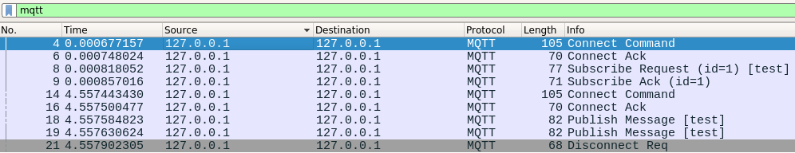
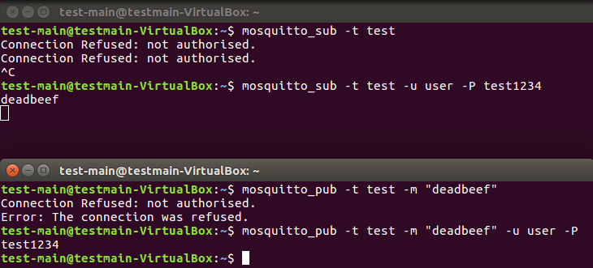
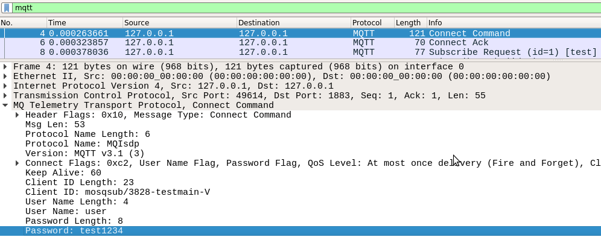

# Assignement 1
## Part 1

MQ Telemetry Transport (MQTT), invented in 1998/1999 by Arcom and IBM, is a protocol which is composed of a broker which can received/send data and clients who can both listen/send data to the broker.

This protocol use two ports : 1883 unsecured MQQT and 8883 secured MQTT. Based on the usage of channels.

The weaknesses are : 

Devices could be compromised

## Part 2 - Virtualbox/Ubuntu Installation and first MQTT requests
On a linux machine, just install VirtualBox with `apt`
```
sudo apt install virtualbox virtualbox-guest-additions-iso
```
`virtualbox-guest-additions-iso` is usefull to switch the VM screen resolution.

Download `Ubuntu 16.04.3` using [this link](http://old-releases.ubuntu.com/releases/16.04.3/ubuntu-16.04.3-desktop-amd64.iso).

Create a new VM and proceed to install Ubuntu.

In the VM, install `mosquitto`, `mosquitto-clients` and `wireshark`
```bash
sudo apt install mosquitto mosquitto-clients wireshark
```
The `mosquitto` broker can be running, to check, simply run 
```bash
service mosquitto status
```
If not, simply run 
```bash
service mosquitto start
```
We need to start a capture on Wireshark to see the MQTT messages. Run Wireshark (maybe as root, depending on your Wireshark installation), and start to capture localhost.

Now, we need to subscribe to a topic. To do so, run
```bash
mosquitto_sub -t test-topic
```
This commande will open a TCP connexion with to the server, and indicate you want to receive all the messages from the "test-topic" topic.

Now let's send a message! Open an other terminal and run
```bash
mosquitto_pub -t test-topic -m "Hello World!"
```
This will send a MQTT request to the server with the message. The server will then forward it to the clients subscribers.
You can now see all of the requests in Wireshark!



## Part 3 - MQTT Security
In order to use authentification, we need to create a password file with `mosquitto_passwd`. This command will create the user `user` assiciated with the password you give.
```bash
sudo mosquitto_passwd -c /etc/mosquitto/passwd user
```
To use enable authentification, you need to add some lines in the configuration file as so
```bash
echo -e "password_file /etc/mosquitto/passwd\nallow_anonymous false" | sudo tee /etc/mosquitto/conf.d/passwd.conf"
```
Then restart the MQTT borker
```bash
service mosquitto restart
```
You can now try to subscribe/publish and will get this result 



## Part 4 - Inspecting MQTT authentification mecanism
 If we capture what we did in part 3, we obtain this connection request

  

  This means that the password is transmited in plain text, it is not encrypted. This is absolutely not secured, a hacker could sniff the network and easily get the login/password. A mean to use MQTT a more secured way is to encapsulate the TCP flow in a TLS tunnel. This way, all the data will be encrypted and the authentification can be achieved a more secured way. We can also use x509 Certification mecanism. The problem is this kind of implementation is not easy because you need to manage certificate for all clients.
