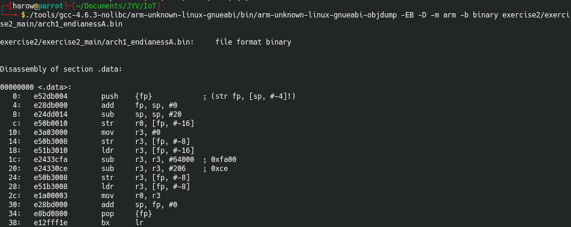
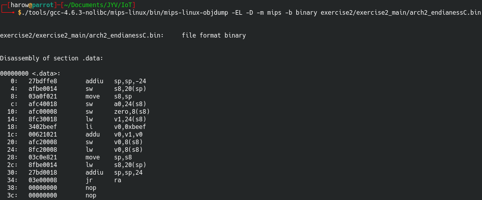
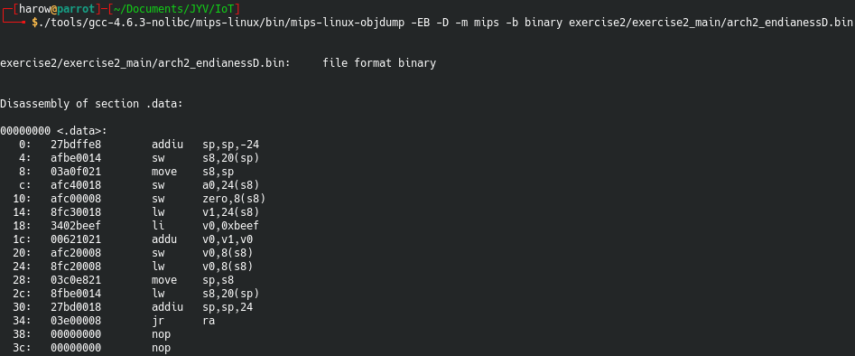
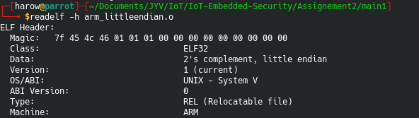

# Assignement 2
## Part 1 - Cross toolchains
Kernel crosstool are a set of tools used to manipulate binaries with a different architecture than your current kernel architecture. For exemple, I'm running Linux Parrot OS with a amd64 architecture. Thanks to th kernel crosstool, I can compile or disassemble binarues from arm, mips or other architecture.

[Here](https://mirrors.edge.kernel.org/pub/tools/crosstool/files/bin/x86_64/4.6.3/) is the link to get the tools for a x86_64 architecture, version 4.6.3

GCC is the GNU C Compiler. This utility is used to compile C program, and with the kernel crosstool, to compile it for a given architecture. This can be usefull to craft a custom payload for a IoT device. `objdump` is used to analyse binary, and disassemble them. We can disassemble binaries from different architecture and read the assembly code to try yo understand the program in order to find vulnerabilities. `objcopy` can be used ot copy binary object into a different format. `readelf` is used to get information from a elf object file. Thanks to this, you can get the architecture, and the endianess of the binary file.

## Part 2 - Reverse engineer raw binary blobs
### Arch 1 - ARM
The first architecture seems to be ARM. When diassembling the file A with big endian, we can find the substraction instruction with `0xface`.



We can see `@0x1c` and `@0x20` the two SUB with `0xfa00` and `0xce`. We can now disassemble the file B in little endian to find the same thing.


### Arch 2 - MIPS
The second architecture looks like MIPS. We can disassemble the file C in little endian. the `li` instruction is the "Load imediate" instruction, used to load value in a register, here the `v0` register. Just after, `@0x1c`, this register is added with the register `v1`.



Now we can disassemble the file D in big endian.



### Arch 3 - PowerPC
Now we can try the last arch, PowerPC.


`@0x10`, we see a 0 being loaded in the register `r0`. After this, we can see the `ori` instruction, that will apply a `or` between `0xcafe` (`0d51966`) and `r0`, which is currently 0. So basically, `0xcafe` is being loaded in r0 register. Right after, the `mr` instruction is used to move the content of `r0` into `r3` register, which is the [return register](https://www.ibm.com/support/knowledgecenter/en/ssw_aix_72/assembler/idalangref_reg_use_conv.html).

## Part 3 - Cross-compile simple program
### ARM

For the ARM architecutre, simply run in the bin folder
```bash
./arm-unknown-linux-gnueabi-gcc ../../../../exercise2/exercise2_main/file.c -o arm_bigendian.o -c -mbig-endian
./arm-unknown-linux-gnueabi-gcc ../../../../exercise2/exercise2_main/file.c -o arm_littleendian.o -c -mlittle-endian
```
After this, we can check the file type like this




### s390x

For the x390x architecture, simply run this command in the bin folder

```bash
./s390x-linux-gcc ../../../../exercise2/exercise2_main/file.c -o s390x.o -c
```

We can check the result like this 

