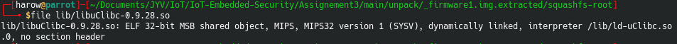

# Assignement 3

## Part 1 - Scrapers
### Scrapy
```bash
pip3 install  Scarpy
```

## Part 2 - binwalk
`Binwalk` is already install with ParrotOS. Current version is 2.2.0

We can install or check update using apt 

```bash
sudo apt install binwalk
```


## Part 3 - Firmware unpacking

### firmware1.img

Let's run `binwalk` to find what's inside `firmware1.img`


As we can see, binwalk is missing `sasquatch`, let's find it and install it

```bash
git clone git clone https://github.com/devttys0/sasquatch
cd sasquatch && ./build.sh
```

and run `binwalk` again


Let's dive into it!


As we can see, this looks like a linux OS, since we can find some interesting directories like `bin`, `home`, `etc` or `var`.

Let's get the tree file list and the hash of all files like so (from the root of the firmware file system)

```bash
tree -pa > ../../firm1list.txt
find -type f -exec sha1sum {} \; > ../../firm1listhash.txt
```

We can find a `www` directory, so the device must have hosted a website. In the file/directory list under the `www` directory, we can find some keywords like `DNS`, `WPS`, `PLC`. This looks like some kind of router, wifi router or Industrial device (a `PLC` is the kind of device we find in plants). Let's `cat` the `index.htm` file

```
  <a target="_blank" href="http://support.netgear.com">Online Support</a> | 
  <a target="_blank" href="http://kb.netgear.com/app/answers/detail/a_id/12923">$router_faq</a>
```

So this seems to be a NetGear device. 

The `/etc/passwd` and `/etc/shadow` are broken symbolic links to `/tmp/config/...`. We can `cat` the `/etc/banner` file to see

```
  _______                     ________        __
 |       |.-----.-----.-----.|  |  |  |.----.|  |_
 |   -   ||  _  |  -__|     ||  |  |  ||   _||   _|
 |_______||   __|_____|__|__||________||__|  |____|
          |__| W I R E L E S S   F R E E D O M
 KAMIKAZE (7.09) -----------------------------------
  * 10 oz Vodka       Shake well with ice and strain
  * 10 oz Triple sec  mixture into 10 shot glasses.
  * 10 oz lime juice  Salute!
 ---------------------------------------------------
 ```

 So the OS of this device is OpenWrt, which is an ["open source project for embedded operating system based on Linux, primarily used on embedded devices to route network traffic. The main components are Linux, util-linux, musl, and BusyBox."](https://en.wikipedia.org/wiki/OpenWrt) (thx wikipedia).

 At the root of the file system we can also find some intersesting text file like `module_name` or `firmware_version`. If we `cat` them, we get

 

 Let's check the Internet... 

 And we find [this!](https://www.netgear.fr/home/products/networking/wifi-routers/wnr2200.aspx)

 

 So we got the device name and the firmware version. We can try to get the architecture by running `file` on a lib file.

 

 The architecture seems to be a `MIPS32`.

 The extraction seems greate, we can find a lot of interesting file, from known linux folder such as /bin /etc. However we can see some broken symbolic link. For example, `/sbin/net-util` does not exist.

 We can try to find some CVE/exploit on the internet

 - [Here](https://www.contextis.com/en/blog/porting-exploits-netgear-wnr2200) is a nice article on the WNR2200 firmware analysis.
 - [An exploit](https://www.exploit-db.com/exploits/33177) is available here, may be this firmware is vulnerable.
 - [Other CVE](https://www.cvedetails.com/bugtraq-bid/95867/Netgear-WNR2000-Multiple-Security-Vulnerabilities.html) cn be found here, but are for an older firmware version.
 - [Here](https://www.cvedetails.com/version-search.php?vendor=Netgear&product=Wnr2000%25&version=1%25) is a list of vulnerabilities for WNR2000 router. Most of them are for older firmware.

 ### firmware.bix

 First, `binwalk`

 

 An other `SquashFS`. `binwalk` also found a Unix path that can indicate the linux kernel version and architecture : `linux-2.4.x` `MIPS`.

 The file system also looks like a linux OS bu way tinier : only 387 files against 1302 for the NetGear firmware. Let's get the file list and the hash of the file

```bash
tree -pa > ../../firm2list.txt
find -type f -exec sha1sum {} \; > ../../firm2listhash.txt
```

The `/etc/version` contains the following information
```
v1.13EU v5.0.0EUb3_patch02 --  Thu Sep 15 17:11:01 CST 2011
```

We can find a `www` directory, with a lot of web files.

When borwsing throught the `www` directory, we can find some graphic assests, and a `model.gif` 


Let's google this... 


This firmware seems to come from a [D-Link DIR-100 router](https://eu.dlink.com/uk/en/products/dir-100-ethernet-broadband-router)

We can see there is less file in this firmware. For example, `/var` folder is empty. `/bin` contains less programs than the previous firmware also. Maybe the extraction is not complete.

- There is 3 vulnerabilities for Dir-100 on [CVE details](https://www.cvedetails.com/vulnerability-list/vendor_id-899/product_id-14956/D-link-Dir-100.html)
- We can find [this one](https://securitytracker.com/id/1020825) but for an older firmware.
- [Bruteforce and CSRF](https://seclists.org/fulldisclosure/2017/Jun/30)
- [This vulnerability](https://vuldb.com/?id.10693) seems to affect our firmware version 1.13/5.0.0EUb patch 2. CVSS 8.8 so it is really critical!
- We can find a CVSS2.0 10 [here](https://nvd.nist.gov/vuln/detail/CVE-2013-6026). The version is not mentioned

### Conslusion

`Binwalk` is a really powerfull tool to extract files. We have found some file such as programs, and web server. With this we have found the version of the firmwares. However, this is not easy to find vulnerability that are compatible with the firmware version. Most of the vulnerabilities found are for older firmware, and sometimes the version is not mentioned. However, we can find some article and search on this firmwares.