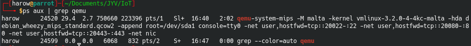
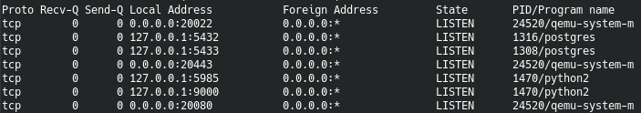
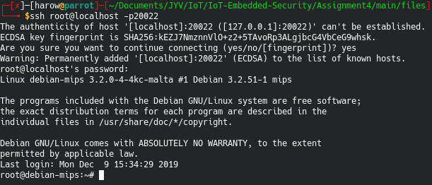
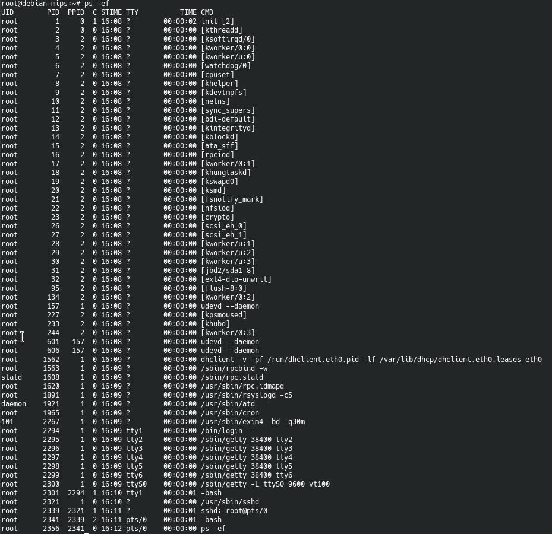
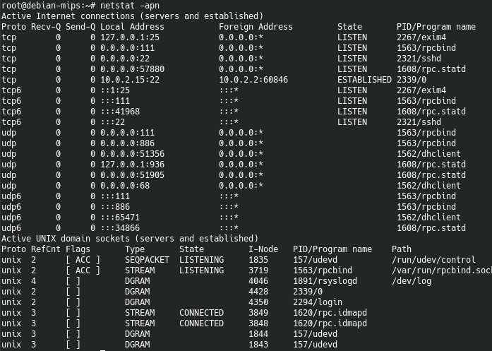
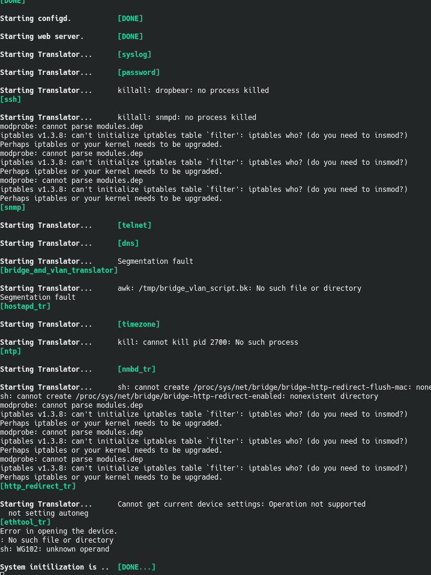
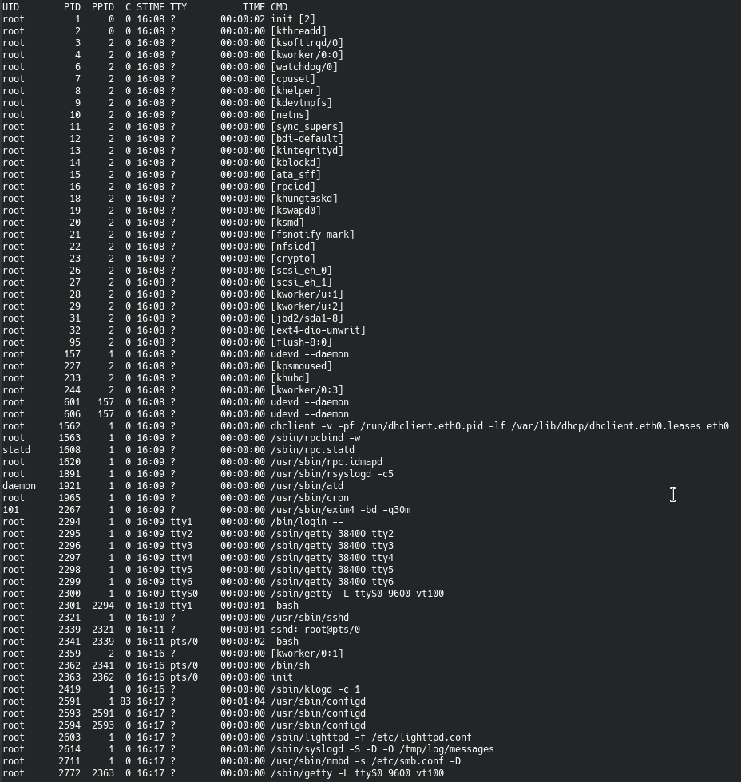
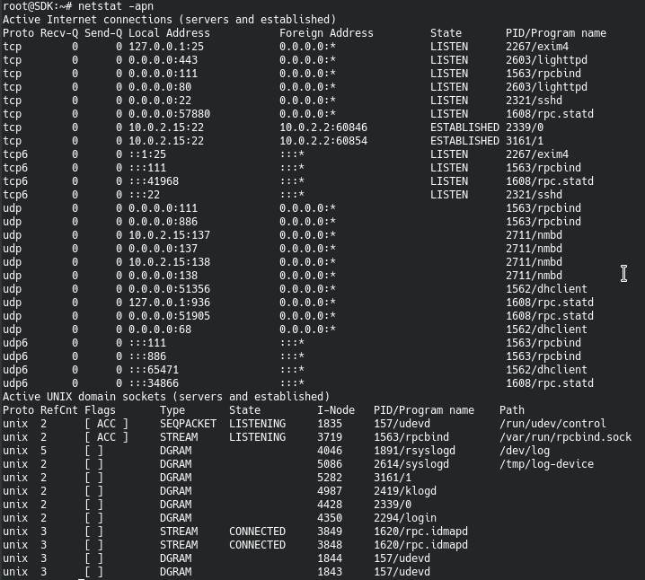

# Assignement 5 - Main

## Part 1 - QEMU MIPS Debian Wheezy
Let's run the same command as in the previous assignement but with all right ports forwarded
```bash
qemu-system-mips -M malta -kernel vmlinux-3.2.0-4-4kc-malta -hda debian_wheezy_mips_standard.qcow2 -append "root=/dev/sda1 console=tty0" -net user,hostfwd=tcp::20022-:22 -net user,hostfwd=tcp::20080-:80 -net user,hostfwd=tcp::20443-:443 -net nic
```

### QEMU process running (in Parrot)


### QEMU netstat (in Parrot)


### QEMU ssh


If a try to ssh directely after the QEMU booted, this makes my entire computer crash. I need to first log into the machine with the emulated terminal, and ask for the status of the ssh server like so :
```bash
service ssh status
```
This does not really seem to resolve the problem.

## Part 2 - Simulate firmware
### QEMU process running (in QEMU)


### QEMU netstat (in QEMU)


### QEMU - Starting firmware
The start of the firmware went pretty well!



### QEMU - process running (in QEMU, firmware running)


### QEMU - netstat (in QEMU, firmware running)
