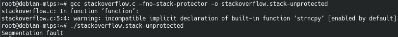

# Assignment 4

## 1. Have QEMU setup and well running

On Kali's VM we will install the following qemu packages by running these commands:

```bash
apt-get install qemu-system*
```
```bash
apt-get install qemu-utils*
```
```bash
apt-get install qemu-user
```
```bash
apt-get install qemu-user-static
```
```bash
apt-get install qemu-user-binfm
```


## 2. Build a VM for QEMU for N architectures

### 2a) Architecture1 = MIPS

To build a Debian MIPS image on QEMU I followed this tutorial: https://markuta.com/how-to-build-a-mips-qemu-image-on-debian/ which is more recent than the one proposed in the documentation of the task.

### 2b) Architecture2 = M68K

To set up Debian/m68k on qemu-system-m68k I followed this tutorial https://wiki.debian.org/M68k/QemuSystemM68k but in the list of the machine availables I don't have q800:


Thus, I tryed the other machines availables but I got error every time:


I also tryed to change the console parameter to follow the tutorial given in the documentation:


Still the same error. I also tryed to purge and reinstall qemu but it did not work.

## 3.
### Stack-Protected

#### simple run


#### strace
 

### gdb


We can see the protection on the stack throw a SIGIOT signal to end the process once the stack is trying to be written

### Stack-Unprotected

#### simple run


#### strace


#### gdb

We can see the address that has been tryied to be reach is 0x41414140, which is 'AAA@'. Those are the characters that has been copyied, and not the return address.

When we run the program with unprotected stack, `strncpy` will overwrite the stack and overwrite the return address. Therefore, when trying to return to the previous contex, the process will try to read a unaccessible address that lead to a Segmentation Fault (SIGSEV).


`gcc` provide a lot of debugging options ([see there](https://gcc.gnu.org/onlinedocs/gcc/Debugging-Options.html)). This options are really useful while debugging, to place breakpoints on source code lines for example.
`gdb` is a well know GNU C debugger. It can start the process of your application, freeze it and execute it step by step while looking at the variables, stack and heap.